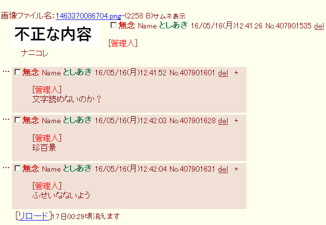

# FAQ
-----------------------------------
ここではよく行われる(行われた/これから先も行われるであろう)質問とその回答をまとめておいた.

## 目次
-----------------------------------
* [Moaiって何ですか？](#user-content-Q_00)
* [このツールで掲示板の規制などが回避できるの？](#user-content-Q_02)
* [ローカルプロキシ？それってproxomitronのフィルターで代用できね？](#user-content-Q_04)
* [試すのが怖いんだけど、このツールの安全性をどう確認すればよいのか？](#user-content-Q_01)
* [User-Agentを偽装するならば単純にブラウザいっぱい入れたり串使えばよいのでは？](#user-content-Q_05)
* [(Virtual USERS機能について)実際にはUA偽装とルーカチ、クッキー削除で大抵の場合いけるよね？](#user-content-Q_07)
* [Androidで使うには？](#user-content-Q_03)
* [過疎らせたい定時があるんだけどどうやればいいの？](#user-content-Q_08)
* [(ふたばちゃんねるにおいて)スレで表示されるレスが全部管理人になっとる？](#user-content-Q_09)
* [Moaiを他サイトで紹介してもいい？](#user-content-Q_10)
* [(ふたばちゃんねるにおいて)Moaiをdel連打ツールとして使うことはできませんか？](#user-content-Q_11)
* [画像投稿時、filenameがフルパスのままで送信されるのではないか？](#user-content-Q_12)
* [日本HTTP研究所(NHK)とか開発チームとかホントはなくて全部同一人物なんでしょ？](#user-content-Q_14)
	

## Moaiって何ですか？
-----------------------------------
太平洋上の孤島に立つ謎の石ｚェ…
…ではなく一般にローカルプロキシと呼ばれるツールの一種である.
ローカルプロキシに関しては、[moai README][1] 「ローカルプロキシとは？」をご覧戴きたい.

  <a href="#user-content-index">目次へ戻る</a>

## このツールで掲示板の規制などが回避できるの？
-----------------------------------
このMoaiを使うことで、あなたの見ている掲示板の規制を確実に回避できるとは限らない.
しかし、User-AgentやCookieの情報、Fingerprintなどといったあなた個人を識別する情報がその掲示板へ漏洩するのを
ソフトウェア的に可能な限り防止することができる.
またMoaiの[VirtualUSERS Initiation機能][3]はボタン一発でこれらの情報をランダムに撹乱する機能である.
そもそもそのようなセキュリティとしての用途がこのツールの本来の役割である.
その副次的な効果として規制を回避できたり、規制されにくくなるといった効果はあるだろう.

  <a href="#user-content-index">目次へ戻る</a>

## ローカルプロキシ？それってproxomitronのフィルターで代用できね？
-----------------------------------
Moaiはローカルプロキシで送信/受信データをフィルタリングして加工するといった手法をとる.
そしてまさにそれはWindowsの有名ツールであるProxomitronが提供するそれと同じものだ.

実のところMoaiは機能としてはProxomitronの足元にもおよばないので
(とはいえ、Proxomitronを密かに目標にしていたりもするｗ)
既にそちらをバリバリ使いこなしている方にとってMoaiは不要だ. 

ただ、それでもMoaiの利点を挙げるとすれば、全ソースが公開されており、
必要であれば修正や改造、さらにはそれをあなたの名前で再配布するなども自由に行えるということがある.

またProxomitron に比べPOST変数のフィルターが容易に行えるという点などが挙げられる.
具体的には filtersフォルダ内のfutaba_send.myfファイルのpost_varsという部分において、
中継時に修正したいPOST変数を記述する形になる.

その他の特徴/機能に関しては[moaiのREADME][1]「何ができるのか？ また同種のツールと比べた場合の特徴は？」
の項をを参照してもらいたい.

  <a href="#user-content-index">目次へ戻る</a>

## 試すのが怖いんだけど、このツールの安全性をどう確認すればよいのか？
-----------------------------------
その感想はもっともだ.
いかに全ソースコードが公開されブラックボックスな部分が全くないとはいえ、
プログラマでもない方にとって、ソースコードを検証するのは酷というものだろう.
この種の問題は我々開発側にとっても頭の痛い、もっとも配慮すべき事項の一つだ.

一応このことに関しては、[moai README][1] の「プログラマでない方へ : Moaiの安全性をどう確認すればよいのか？」
の項に我々の考えを述べてある.

ここにある記述で納得していただけるかどうかはわからないが
もしそれなりの納得が得られたなら是非とも自力でのコンパイルを試して戴きたい 

### 
> moaiは現在、おかげさまで作者が当初思っていたより多くの方に使われているようで感謝感激の極みである.
> この種の質問もあまりされることなくはなったのだが、このQ and Aはそのまま残しておく.

  <a href="#user-content-index">目次へ戻る</a>

## User-Agentを偽装するならば単純にブラウザいっぱい入れたり串使えばよいのでは？
-----------------------------------
勿論ブラウザをいっぱいインスコしておいてもかまわないがMoaiの[VirtualUSERS Initiation機能][3]を使えば
user_agent.txtに適当なUA名を列挙しておくことにより、事実上無限かつお手軽にそれができる. 

また、外部プロキシを介したからといってUser-Agentが変化するとは限らない.
そのようなUser-Agentを加工修正するプロキシも存在するかもしれないが、User-Agentに関して
一切手を加えないプロキシも数多く存在する.

>**【参考】**
>
> IPアドレスを偽装することはMoaiでもできない.
> しかし、これらはルーカチ(ルータリセット)や外部プロキシ、VPNなどで比較的簡単に変更可能である.
>
> 旧来は、IPアドレスやプロバイダのドメインだけで規制を行うのが多くの掲示板の主流であったが、
> この方式では（特にプロバイダのドメインでの規制は）巻き添えが頻繁に発生しがちであった.
> そこで、最近の多くの掲示板ではIP以外のマシン固有の情報を重視する流れが主流となりつつある.
> (User-Agentもこの種の情報の一つだ).
>
> つまり、掲示板のサーバ側から見れば、アクセスして来た対象のIPとそのUser-Agentの双方を見て
> (実際にはUser-AgentだけでなくScreen-Sizeなど他のマシン固有情報も総合的に考慮したものであるが)、
> もしそれらのうちのいずれか一方でも変化していないならば規制対象として継続するか
> 要警戒対象とみなすという方式だ.
>
> 基本的にMoaiはIPアドレス以外のソフトウェア的に実現可能な環境の仮想化の全てを
> お手軽に実現するツールと割り切って欲しい.
> その上で、一応IPアドレスに関するおまけ的なサポート要素とはなるが、外部プロキシの切り替え機能がある.
> これは外部プロキシの候補をparent_proxy.txtに列挙しておきそれらの候補をWeb Configurationのメニューから選択して
> 使用するプロキシを瞬時に切り替える機能となる(Ver1.0より正式に搭載).

  <a href="#user-content-index">目次へ戻る</a>

## (VirtualUSERS Initiation機能について)実際にはUA偽装とルーカチ、クッキー削除で大抵の場合いけるよね？
-----------------------------------
実のところその通り!
さらにそれでもダメならMoaiのVirtual USERS機能を試してみてほしい
MoaiならばスクリーンサイズやFingerprintの値などといったさらに深いレベルの情報をランダム化することもできる.

  <a href="#user-content-index">目次へ戻る</a>

## Androidで使うには？
-----------------------------------
Moaiは基本的にPC向けのツールであるが、Androidでも使うことができる.
Androidでのコンパイルはかなり手間なので、Android向けにコンパイル済みのバイナリもbin_for_androidディレクトリにおいて提供してある.
面倒ならばこちらを使って欲しい.
Android版Moaiの起動に関しては[Moai README][1]の「Android版における初回起動までの手順」の項に解説しておいたので参考にして欲しい.

コンパイルする場合は Android NDK を使う.
[HowToCompile][4]の「Androidについて」の項に詳しい手順を解説しておいたので参考にして欲しい.

尚、現時点ではまだまだAndroidでのテストが不十分だ.
作者の環境だけでは限界があるためだ.
動作報告や不具合報告など大歓迎だ 

  <a href="#user-content-index">目次へ戻る</a>

## 過疎らせたい定時があるんだけどどうやればいいの？
-----------------------------------
残念ながら(?)Moaiはそういう攻撃用のツールではなく、完全に防御向けのツールだ.
つまり、それに関してMoaiがサポートできることと言えば、キミとその定時との戦いにおいて
キミのHPを限りなく∞にすることくらいだ.

  <a href="#user-content-index">目次へ戻る</a>

## (ふたばちゃんねるにおいて)スレで表示されるレスが全部管理人になっとる？
-----------------------------------
とりあえずMoaiは無事起動しているようだねｗ
としあきという人種は管理人さん降臨が大好きだと聞いたもので、お遊びですべてのスレとレスで仮想的に降臨させてみたｗ

  

まあ要するにこれは受信するHTMLをフィルタで文字列置換することにより実現しており、
その指定をしているのがfilters/futaba_recv.myf になる.
このファイルを開いてもらうと
~~~
  replace ['<blockquote>'] ['<blockquote>[管理人] ']
~~~
という行があるが、「これは前者を後者で置換(replace)せよ」という命令になる.
というわけで、この「管理人」さん表示を消したい場合は、この行をまるごと削除すればOKだ.

  <a href="#user-content-index">目次へ戻る</a>

## Moaiを他サイトで紹介してもいい？
-----------------------------------
全く問題ない.
どこで宣伝してもらってもかまわないし、別の場で再配布することも可能だ.
プラグインを作ったり、Moai本体を改造などしてあなたの名前で公開することすらできる！ 

  <a href="#user-content-index">目次へ戻る</a>

## (ふたばちゃんねるにおいて)Moaiをdel連打ツールとして使うことはできませんか？
-----------------------------------
おそらくできない(というか出来てしまうようでは掲示板として問題だとは思う).

Moaiが出来ることといえば、User-AgentやScreen-Size、Fingerprintなどソフトウェア的に
仮想化可能な情報のランダマイズ、そしてIPアドレスに関しては複数の登録プロキシの中から
メニューで選択し、使用プロキシを簡易に切り替えを行う程度のことだ.

これらの切り替えを駆使すれば「そうだね」の値はカウントされることは私の方でも確認できた.
delについては効果があるのかどうかはわからない(というかそこまで詳しくは試していない).
ふたば側から見れば、それがプロキシサーバを経由したdelであるか否かはある程度検出できるはずだ.
そしてそのようなdelを無効としてカウントしていない可能性もある.

  <a href="#user-content-index">目次へ戻る</a>

## 画像投稿時などfilenameがフルパスのままで送信されるのではないか？
-----------------------------------
この問題は事実上IE7以前の場合のみに存在するため、それ以外のブラウザをご使用の方には関係ない話となる.
また、IE7以前をご使用の方でも、現在コミットされている最新バージョンについては、問答無用でフルパスを
除去するようにしてあるため、これに関して心配する必要はない.

少し詳細を述べると、そもそもIEはファイルアップロード時にサーバにそのフルパスを送りつけるという奇妙な仕様を持っていた.
IE以外のブラウザの場合、フルパスを送るという仕様を持つブラウザは現在のところ確認されていない.
例えばFirefox, Opera, Chromeなどではいずれも送られるのはファイル名の部分のみであり
Moaiが中継段階で加工するまでもなく最初からフルパスは除去されている.

さらに厳密に言えば、フルパスが送られるのは以下の場合に限られる

<ul>
<li>IE6以前から画像投稿した場合.</li>
<li>IE7で「サーバーにファイルをアップロードするときにローカルディレクトリのパスを含める」
   というブラウザのセキュリティ設定を有効としてしまっている場合.
   IE7ではこれがデフォルトで有効となっている.
   尚IE8以降よりこの設定はデフォルトで無効になっている.
   無論、セキュリティ上これは本来無効であるべきで、妥当なデフォルトと言える.</li>
</ul>

上記を合わせ考えればフルパスを問答無用で除去してファイル名の部分のみにした上で、
付属のuser_agent.txtにはIE6以前のUser-Agentを含めない方ようにすれば確実である.
(ただしOperaでの擬似IE User-Agentは残しておいても問題なかろう)
現在コミットされているuser_agent.txtは、この点を踏まえたものになっている.

  <a href="#user-content-index">目次へ戻る</a>

## 日本HTTP研究所(NHK)とか開発チームとかホントはなくて全部同一人物なんでしょ？
-----------------------------------
ハドラー…その質問に対する我々の答えは常にひとつ…~~大魔王様のおｋ~~
すなわちNYSK(煮るなり焼くなり好きに解釈しろ)だ.

こんな研究所やチームが存在するかもしれないし、ひとりで自演しているかもしれない.
あるいは、もっと大人数で不特定多数の人間が同じ名前を使いまわしているかもしれないし、
実は誰もいない（！？）AIのようなものかもしれない！？

あなたがもっとも楽しめる解釈をすればそれが一番よいではないかｗ.
あなたを含め我々は皆、匿名掲示板のユーザ(virtual users)なのだから.

  <a href="#user-content-index">目次へ戻る</a>

[1]: https://github.com/mr-moai-2016/znk_project/blob/master/src/moai/README.md
[2]: https://github.com/mr-moai-2016/znk_project/blob/master/src/moai/Reference.md
[3]: https://github.com/mr-moai-2016/znk_project/blob/master/src/virtual_users/VirtualUSERS.md
[4]: https://github.com/mr-moai-2016/znk_project/blob/master/src/HowToCompile.md
[5]: https://github.com/mr-moai-2016/znk_project/blob/master/src/Hacking.md

