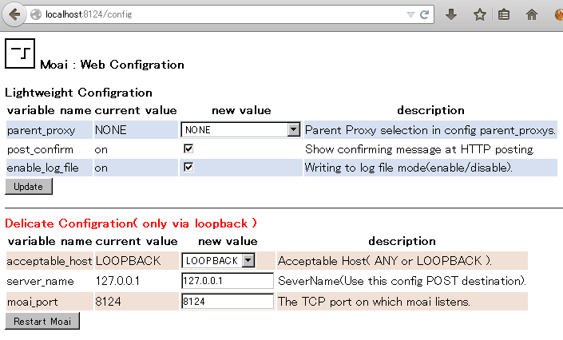
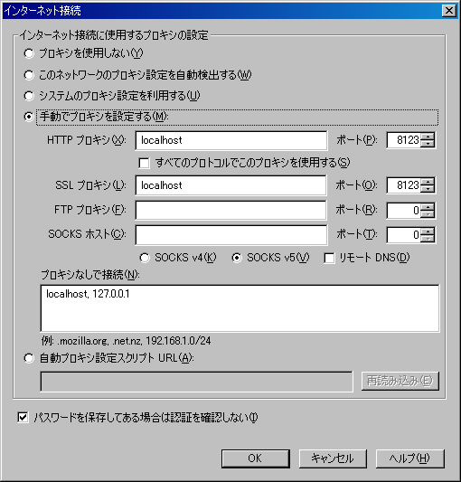

# Moai
-----------------------------------

## 目次
-----------------------------------
* [Moaiとは？](#user-content-pos1)
* [ローカルプロキシとは？](#user-content-what_localproxy)
* [何ができるのか？ また同種のツールと比べた場合の特徴は？](#user-content-pos2)
* [インストール/アンインストール方法](#user-content-pos4)
* [Android版における初回起動までの手順](#user-content-for_android)
* [初めてのMoai](#user-content-pos5)
* [プロキシ設定ダイアログって何ぞ？](#user-content-pos6)
* [いっしょに含まれているhttp_decoratorとかZnkとかいうのは何なのか？](#user-content-pos7)
* [プログラマでない方へ : Moaiの安全性をどう確認すればよいのか？](#user-content-for_not_programmer)
* [プログラマな方へ](#user-content-for_programmer)
* [その他の情報(リファレンスマニュアル、Virtual USERS機能、FAQなど)](#user-content-others)
* [ライセンス](#user-content-license)
* [ご注意](#user-content-warning)
* [免責事項](#user-content-as_is)

## Moaiとは？
-----------------------------------

  このツールは一言で言えばHTTPを仲介するローカルプロキシである.
  同種のツールとしてはProxomitronやPolipoなどがあり、これらをご存知の方は
  それと基本的に同じようなものである.

  <a href="#user-content-index">目次へ戻る</a>

## ローカルプロキシとは？
-----------------------------------

  通常、プロキシを使う場合、あなたと最終接続先となるホスト以外の第三者である
  プロキシサーバへと接続して通信を仲介させる. 概念的には以下のようになる.

~~~
    ブラウザ <=> 外部サーバのProxyプログラム <=> 接続先サイト
~~~

  これにより、接続先サイトからはあなたのIPアドレスが隠蔽される.

  一方、ローカルプロキシとはそのような第三者となるサーバで仲介するのではなく、
  この仕事を文字通り今あなたの使っているコンピュータ上で行うというものである.
  概念的には以下のようになる.

~~~
    ブラウザ <=> あなたのマシン上で動作するローカルプロキシ <=> 接続先サイト
~~~

  お気づきだと思うが、ローカルプロキシがあくまであなたのマシンで動作している以上、
  接続先サイトから見ればあなたのマシンからの通信となる. つまりIPアドレスは隠蔽されない.
  ローカルプロキシを使う目的は IPアドレスを隠蔽することではないのだ.

  では何のためにこれを間に挟むのか？

  Moaiに限らず、一般にローカルプロキシは、あなたのブラウザとサイトとの通信を仲介する.
  その主たる目的は、あなたが定義したフィルタに従って、その通信内容をフィルタリング
  することである. このフィルタリングの対象となるホストは細かく選択することもできる.
  例えば www.moai-chan.net という掲示板があったとして、そのサイトとの通信を行う場合のみ
  ある種のフィルタリングを行い、その他のサイトに関してはまた別のフィルタを使ったり
  そもそもフィルタリングを行わないといった具合である.

  これによって特定の接続先サイトに送られるあなたのマシン固有の情報を遮断したり
  偽装したりすることができる. つまりローカルプロキシとはプライベートを守るための
  セキュリティーツールであり、それが本来の目的である.

  接続先サイトに送られるこの種の情報とは具体的にはUser-AgentなどのHTTPヘッダの内容、
  POST時の変数の内容、Cookieの内容などである.
  あなたが使っているブラウザには特にクリーンアップしない限りこの種の情報があちこちに残留している.
  ローカルプロキシのフィルタリングはこれを遮断したり加工修正することで
  接続先サイトにこれらがそのまま送信されることを防ぐ.

  また一方、受信においてサイトからの応答時のデータ(HTML, Javascriptのjsファイル, cssファイルなど)
  を加工修正することもできこれを応用することで、ページのレイアウトを好みの形に修正したり、
  広告を除去したりすることができる. 

  <a href="#user-content-index">目次へ戻る</a>

## 何ができるのか？ また同種のツールと比べた場合の特徴は？
-----------------------------------

  機能的な面に関しては以下の点が挙げられる.

  <ul>
  <li>GET時(単純にページ閲覧時など)におけるテキストデータの文字列置換フィルタリング等が容易に行える.
      またpluginを導入することによりさらに高度で自由なフィルタリングを行うこともできる.</li>
  <li>POST時(掲示板投稿時など)、HTTPヘッダ、クッキー、POST変数に関する値を改変するなどが容易に行える.
      またpluginを導入することによりさらに高度で自由なフィルタリングを行うこともできる.</li>
  <li>POST時(掲示板投稿時など)、送信される全ヘッダおよびPOST変数データの確認表示が可能で、
      そのとき実際に何が送信されているのかを解析するのに最適である.
      またpluginを導入することにより、あなたのマシン環境を仮想化、ランダマイズ化する
      [**Virtual USERS Initiation** 機能][2]を搭載している.</li>
  <li>**ignore_hosts** に通信をブロックしたいホストを記述しておくことで余計な通信を未然に防ぎ、
      結果的にあなたが普段よく見るサイトの表示をすっきりさせたり高速化する.</li>
  <li>ブラウザが行う全HTTPを仲介しており、すべての通信内容をあなたへレポートする.  
      このレポートはターミナル(Windowsの場合コマンドプロンプトウィンドウ)において行われ、
      また**moai_log.log**というファイルにログとしても記録される.</li> 
  </ul>

  処理の透明性、安全性、移植性、および動作環境に関して以下の点が挙げられる.

  <ul>
  <li>Moaiは完全なオープンソースであり、ブラックボックスな部分は一切存在しない.</li>
  <li>使用ライセンスNYSLは多分これ以上ないくらいに緩いものである.</li>
  <li>この種の処理を実現するためのコードとしては同種のものと比べかなりコンパクトで
      必要最小限に絞られており見通しが立ちやすい.
      またこれにより、未知の不具合により潜在的なセキュリティーホールを含むリスクを抑えられる.</li>
  <li>コードはCで記述されており、使用している外部のライブラリは基本ライブラリであるlibZnkのみである.
      (libZnkもオープンソースでNYSLである). 従って問題発生時に比較的追跡がしやすい.</li>
  <li>コンパイルが容易である(VCのほぼ全バージョン、MinGW、gccなどでコンパイル可能).</li>
  <li>実行バイナリはWindowsやLinux(Androidも含む)で動作する(未確認だがMacOSでも多分大した修正なくいけるだろう).</li>
  </ul>

  以下はかなり高度な技術面に関する参考事項である.

  <ul>
  <li>HTTP CONNECTによるトンネリングによりHTTPSを仲介することができる.
      これにより例えばGoogle検索やYoutube、nico動画などを見ることも可能である.</li>
  <li>Socket通信における非ブロッキング接続やHTTPパイプライン化の中継をサポートする.
      ブロッキング接続では、複数のタブを開いてWebを閲覧する場合に、最初の接続が終るまで２番目３番目の接続が
      ブロックされ待たされてしまうが、非ブロッキング接続によってこの問題を回避できる.</li>
  </ul>

  Moaiの提供する機能は同種のツールであるProxomitronやPolipoなどと比べ、
  機能はずっと限定されるため、普段これらを使いこなしている方にとっては
  これは不要かもしれない. 

  しかしPOST変数に関するフィルタリングに関してはProxomitronとPolipoはいずれも直接はサポートしておらず、
  それを実現するには外部ツールを使う必要があるなどやや煩雑になる. 対してMoaiはフィルタファイルにより
  これがダイレクトかつ容易に設定できるため、その点では有利である. 

  <a href="#user-content-index">目次へ戻る</a>

## インストール/アンインストール方法
-----------------------------------

  特にない. 
  同様にアンインストールのための特別な手順もない.
  レジストリなどへの書き込みやこのフォルダ配下以外への一時ファイルの作成などは一切行われない.
  不必要になったらこのフォルダ毎削除すればよい.

  ただ、Windowsであればmoai.exeのショートカットを作り、デスクトップに置いておけば
  より快適であろう.

  このツールはLinuxでも動作し、Linux用の実行用バイナリも一応同梱してあるが、
  ディストリビューションやそのライブラリのバージョン構成によっては動作しないということも有り得る.  
  必要なら[HowToCompile.md][3]を見てもらいソースコードからコンパイルして戴きたい. 
  (Moaiのソースコードは src/moaiにある).

  <a href="#user-content-index">目次へ戻る</a>

## Android版における初回起動までの手順
-----------------------------------
  Android版のMoaiをご利用いただく方はここを一読願いたい.
  Android版に関しても、PC版と同様にznk_project-master.zipをダウンロードして使用して戴く形となる.
  ただしいわゆる一般的なAndroidアプリとは起動方法が異なるため、以下にファイルのダウンロードから
  初回Moai起動までの全手順を説明する.

  <ul>
  <li>1. まずAndroidのWebブラウザよりznk_projectのページへアクセスし、
         PC版と同様にznk_project-master.zipをダウンロードする.
  </li>
  <li>2. Androidのホーム画面より「端末エミュレータ」を開く.
  </li>
  <li>3. ホームディレクトリへ移動する.
         以下のように入力しEnterを押す.
~~~
    cd
~~~
  </li>
  <li>4. ダウンロードした znk_project-master.zip は通常 /storage/sdcard0/Download ディレクトリに保存されている.
		 システム構成によっては違う場所に保存されるかもしれない. その場合はその場所に読み替えて欲しい.
         ホームディレクトリ以外では書き込み権限および実行権限の関係で実行することができない.
         そのため、znk_project-master.zip をホームディレクトリへコピーする必要がある.
         以下のように入力しEnterを押す.
~~~
    cp /storage/sdcard0/Download/znk_project-master.zip ~/
~~~
  </li>
  <li>5. znk_project-master.zip を解凍展開する.
         以下のように入力しEnterを押す.
~~~
    unzip znk_project-master.zip
~~~
  </li>
  <li>6. znk_project-master/bin_for_android ディレクトリへ移動する.
         以下のように入力しEnterを押す.
~~~
    cd znk_project-master/bin_for_android
~~~
  </li>
  <li>7. moai_for_android.sh に実行権限を付与する.
         以下のように入力しEnterを押す.
~~~
    chmod 755 *.sh
~~~
  </li>
  <li>8. moai_for_android.sh を起動.
         以下のように入力しEnterを押す.
~~~
    ./moai_for_android.sh
~~~
  </li>
  </ul>

  尚、上記 1 から 7 までの手順は最初の一回だけでよい.
  これらを一度済ませてしまえば以降は上記 8 だけでMoaiが起動可能である.

  尚、moai_for_android.shにおいて特に明示的にCPUのアーキテクチャを指定したい場合は
  引数にそのアーキテクチャのABI名を指定する. 例えばandroid-x86 エミュレータ上で動作させたい場合
  ./moai_for_android.sh x86 などと実行すればよい.

  <a href="#user-content-index">目次へ戻る</a>

## 初めてのMoai
-----------------------------------

  初めてMoaiを使う場合は、以下の手順で設定しよう.

  <ul>
  <li>1. moai(Windowsならmoai.exe)を起動する.
         (Android版の場合は[「Android版における初回起動までの手順」](#for_android)を参照.)
  </li>
  <li>2. ブラウザのプロキシ設定ダイアログでプロキシサーバとして localhost:8124 を指定する.
         これでうまくいかない場合は 127.0.0.1:8124 で試してみよう! 
         これは一般にループバック接続と呼ばれ、自分自身への接続を意味する.
         リモートホストで起動しているMoaiに接続したい場合はそのIPを指定してもよい.
  </li>
  </ul>

  基本的には以上である.
  ブラウザから目的のサイトへアクセスできればOKである.
  さらに http://127.0.0.1:8124 にアクセスし、Welcome to Moai Web Serverのページが表示されることも確認しよう.

  特に新しくMoaiをダウンロードした直後、デフォルトの設定値では掲示板によっては無効となって
  レスなどができない可能性もあるので、初めてのMoai起動時はまずMoai Web Configuration画面にある
  「Virtual USERS Initiation」ボタンを押し、この設定値を一旦あなた用に初期化しておいた方がよい.
  これについての詳細は[こちらも][2]ご覧いただきたい.

  もし「プロキシサーバへの接続を拒否されました」のような表示がなされた場合は
  おそらく 1 を起動していないか 2 の手順で何か指定をミスしている.  
  あるいはOSのファイアウォール機能により8124への接続がブロックされている可能性もあるので
  その設定を確認してみよう.  

  Windows XP以降の場合、次のようなダイアログが表示される場合がある.  
  

  ここで「ブロックする」を選んでも、このツールをローカルプロキシとして使う分には特に問題ない.  
  ただ、他のLAN上のマシンなどからの利用をしたい場合は、このブロックを解除する必要がある.

  **【参考】**
~~~
    このダイアログは一体何なのか？  

    少し詳しく述べると、サーバのような外部のマシンからの接続要求の可能性があるプログラムにおいて
	初回起動時に必ず表示されるものである.  この種のプログラムを過去にインストールしたことがある方なら
	見たことがあるという方も多いのではないだろうか？
  
    さらにプログラマの方向けの話になるが、このダイアログは INADDR_ANYを指定してWinSock2 APIでの
    bind を実行すると表示される.
~~~

  Moaiは簡易Webサーバとしても機能する.  
  Moaiが起動している状態でブラウザのURL指定欄に http://localhost:8124 または http://127.0.0.1:8124 を
  指定してアクセスした場合、Welcome to Moai Web Serverといったようなページが表示される.
  ここからdoc_rootにあるファイルにアクセスしたり、Moai Web Configuration画面などを出して設定などを
  行うことができる.  

  Moai Web Topページ  
  

  Moai Web Configuration  
  

  <a href="#user-content-index">目次へ戻る</a>

## プロキシ設定ダイアログって何ぞ？
-----------------------------------

  プロキシを使ったことがある方なら、この項目を読む必要はない.
  **使ったことありまへぇん**な方でも、プロキシの設定方法に関してはググればいくらでも
  出てくるのでそちらをご覧戴きたいが、それで片付けるのもなんなので、以下では初心者の方
  向けにFirefoxを例にとって具体的な設定方法を一応説明する.

~~~
  1. 「ツール」メニューから「オプション」を選び、例の色々設定できる画面を開く.
  2. 「詳細」タブを選び、そこにある「接続設定」ボタンを押す.
  3. 「インターネット接続」ダイアログ(下図)が出るので「手動でプロキシを設定する」
      という部分にチェックをつける.
  4.  すぐ下にある「HTTPプロキシ」の部分に localhost (または127.0.0.1) と入力する.
      また右隣にある「ポート」の部分に 8124 と入力する(このとき日本語入力はOFFにしておこう!)
  5.  同様にその下にある「SSLプロキシ」の部分に localhost (または127.0.0.1) と入力する.
      また右隣にある「ポート」の部分に 8124 と入力する(このとき日本語入力はOFFにしておこう!)
  6.  moaiを起動する.  
~~~
  以上である(先にmoaiを起動させておいてもよい).

  

  **【重要】**  
  元の設定に戻す(プロキシを使用しない)方法も覚えておこう.
  上記 3. において「プロキシを使用しない」という項目が一番上にある.
  これにチェックをつけることで、Firefoxはプロキシを介さない通常の状態に戻る.
  (Firefoxの初期設定では元々この状態のはずである)

  もしmoaiの方が何か変なことになった場合は、一度moaiを終了して再び起動させれば
  大抵の場合は問題は解消される. 万一閲覧しているサイトがどうしてもmoaiを介した場合に
  うまく表示されないなど不具合が発生する場合は、ブラウザのプロキシ設定を元に戻した上で閲覧しよう.

  <a href="#user-content-index">目次へ戻る</a>

## いっしょに含まれているhttp_decoratorとかZnkとかいうのは何なのか？
-----------------------------------

  Moaiは我々**日本HTTP研究所(通称NHK)**のボスである**Mr.Moai**氏が開発したローカルプロキシエンジンであり、
  このツール群のまさに中核である.
  また、http_decoratorは我々の**飲み仲間**である DecoDecoBoy氏が**酔った勢いで**即興で書いた簡易HTTPクライアントであり、
  現状ではplugin等の内部から呼び出されることがある.
  libZnkは日本HTTP研究所(NHK)のふたば/２ちゃんねる地区担当の裏エージェントZenkakuが開発したライブラリで
  上記のツールをC言語で記述する際の基盤として使われる. そのため、これらがこのフォルダに含まれる.

  とまあ、**こんな99.9％どうでもいい話**は置いといて、Moaiはブラウザのクッキーやキャッシュなどを実際に消去したり、
  あなたのモニタの解像度を実際に変更したりなどといったことは勿論行わない. 
  そうではなく通信時に仲介するフィルタを変更することによって、
  サイトへと送られる情報を改変し、そのような状況を仮想的にシミュレートしている.

  filtersやpluginsには、Moaiのフィルタや機能拡張のためのモジュールが格納されている.
  Moai自体はどこのサイト専用というわけではなく、あらゆるサイトに使うことができる汎用のツールである.
  [Virtual USERS機能][2]は、フィルタやプラグイン機能を使って実現している形となり、
  現時点ではfutabaまたは2ちゃんねる向けのモジュールがデフォルトで提供されている.
  必要なら新たなサイト向けのフィルタやプラグインをあなたが新しく作ってMoaiの機能を拡張することも可能だ.

  <a href="#user-content-index">目次へ戻る</a>

## <a name="for_not_programmer">プログラマでない方へ : Moaiの安全性をどう確認すればよいのか？
-----------------------------------

  この項目はプログラマではない人向けのものである.

  そして一応、そのような方でもすぐに使えるように、zipファイルにはソースコードに加え
  Windows用とLinux用の実行バイナリも同梱してある. インストール等特別な作業は不要である.

  しかし、このツールが**安全であるという確証**がなければ安心して使えないという方もおられよう.
  残念ながら「いくらこれは安全です」と作者である我々が言ったところでほとんど何の確証にも
  ならない. あなたの良く知る友人が言うなら少しは信用できるかもしれないが、これに関する
  唯一確実な方法は、ソースコードを見て納得してもらう他ない. というわけで全ソースコードも
  同梱してある.

  とはいえ、我々プログラマでさえ、オープンソースのツールを使うとき、そのコードの隅々まで
  読んでから使うなど稀なことである. ましてやプログラマでもない方にこれをせよというのは
  酷というものである.
  
  ではどうすればよいか？
  ソースコードが公開されている事実だけでよしとして、それ以上は気にしないというのも一つの
  考え方である. 一方、その内容を一応検査してから使いたいという慎重派な方は、あなたに
  プログラミングに詳しい知り合いがいるなら、このソースコードをざっくりとチェックして
  もらうのもよい. そんな知り合いはいない方はプログラミングを扱う掲示板などでこのツールの
  ソースコードをアップロードするなどして意見を聞き、あなたなりの納得を得るのもよいかもしれない.

  さらに潔癖な方は、付属するソースコードをコンパイルしてそれを使用することを勧める. 
  機械的な作業なので言うほど難しくはない(…と我々は思うのだが…).
  もちろん同梱してある実行バイナリは、同じく同梱してあるソースコードからコンパイルしたもの
  なのであるが、例えばあなたがそのことを疑って、本当にそうであるという確証が欲しいと思った
  とする. そのためには、あなた自身が同梱してあるソースコードをコンパイルし、出来上がった
  実行バイナリを使ってもらうしかない.

  というわけで付属の[HowToCompile][3]にはコンパイラの入手方法、インストール/設定方法、
  実行方法に至るまで、全くの初心者でもわかるようこれでもかというくらい丁寧にその手順を
  書いたつもりである.

  <a href="#user-content-index">目次へ戻る</a>

## プログラマな方へ
-----------------------------------

  Moaiのコードにおける基本的な背景や改造するにあたって把握しておきたい処理全体の流れ、
  またプラグインを開発する際のヒントなどを[Hacking][4]にまとめておいたので興味があれば
  参照されたい.

  <a href="#user-content-index">目次へ戻る</a>

## その他の情報(リファレンスマニュアル、Virtual USERS機能、FAQなど)
-----------------------------------

  Moaiに関するさらなる詳細については [リファレンスマニュアル(Reference)][1] をご覧いただきたい.  
  MoaiのVirtual USERS機能については、[VirtualUSERS][2]を参照して戴きたい.  
  Moaiに関するFAQについては [FAQ][5] をご覧いただきたい.  

  <a href="#user-content-index">目次へ戻る</a>

## ライセンス
-----------------------------------

  NYSL(煮るなり焼くなり好きにしろ)である.  
  ( NYSLについては http://www.kmonos.net/nysl を参照. )  
  現時点での公式のソースリポジトリは https://github.com/mr-moai-2016/znk_project であるが
  再配布はご自由にどうぞ.

  <a href="#user-content-index">目次へ戻る</a>

## ご注意
-----------------------------------

  Moaiは生まれたばかりのローカルプロキシです.
  特に重要な内容を伴う情報の通信を確実に行う必要がある場合においては、
  まず問題ないとは思うが、念のためMoaiの使用を一時中断するなどした方がよいかもしれない. 

  また、このプログラムはポート番号8124においてクライアントからの接続をリッスンする.
  (このデフォルトのポート番号はconfig.myfより変更することもできるが、その場合は
   8124をその番号で読み替えて欲しい). 
  ここで言う「クライアント」とは、あなたのマシン、あるいは家庭内LANなど極めて小規模で
  安全性が明らかなマシンにおいて、あなたの使うWebブラウザやその他のローカルプロキシなどのソフトなどのことである.

  仮に外部ネットワーク(WAN)からの不特定多数からの接続を許可した場合、
  Moaiは一般的なプロキシサーバのソフトと同様の処理を行うが、このような用途での使用は想定されていないため、
  基本的にWANからのIPアドレスの接続要求があった場合、それを許可してはならない. 
  (Squidなどのプロキシサーバ用の専用ソフトが行っている様々な防衛機構は、Moaiではほとんど搭載されていないためである)

  よってあなたがルータの設定を特別弄くっていない限りは通常は心配いらないことであるが、
  **acceptable_host**を**ANY**として、さらにルータやファイアウォールの8124ポートを開けているなど
  WANからの接続を可能としたような**チャレンジャーな**使い方をされる予定なら、
  Moai側での防御として**access_allow_ips** や**access_deny_ips** などで不要なIPからの接続要求を弾くなどし、
  セキュリティ面にも十分配慮して欲しい.

  <a href="#user-content-index">目次へ戻る</a>

## 免責事項
-----------------------------------

  本ソフトウェアは「現状のまま」で、明示であるか暗黙であるかを問わず、
  何らの保証もなく提供されます. 本ソフトウェアの使用によって生じるいかなる損害についても、
  作者は一切の責任を負わないものとします.

  This software is provided 'as-is', without any express or implied warranty.
  In no event will the authors be held liable for any damages arising
  from the use of this software.

  <a href="#user-content-index">目次へ戻る</a>

[1]: https://github.com/mr-moai-2016/znk_project/blob/master/src/moai/Reference.md
[2]: https://github.com/mr-moai-2016/znk_project/blob/master/src/virtual_users/VirtualUSERS.md
[3]: https://github.com/mr-moai-2016/znk_project/blob/master/src/HowToCompile.md
[4]: https://github.com/mr-moai-2016/znk_project/blob/master/src/Hacking.md
[5]: https://github.com/mr-moai-2016/znk_project/blob/master/src/moai/FAQ.md
