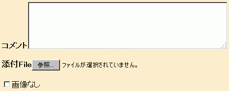
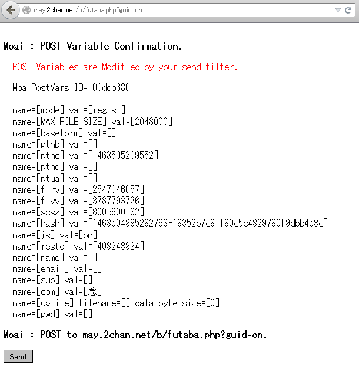

# Moai リファレンスマニュアル
-----------------------------------

## <a name="index">目次
-----------------------------------
* [ターゲットとは？    ](#user-content-target)
* [受信フィルタについて](#user-content-filter_recv)
* [送信フィルタについて](#user-content-filter_send)
* [無用なホストへの接続をブロックする(ignore_hosts機能)](#user-content-ignore_hosts) 
* [POST時の確認メッセージ表示(post_confirm機能)](#user-content-post_confirm)
* [他のマシンからの接続を許可/制限する](#user-content-acceptable_host)
* [外部プロキシを使いたい場合どうするのか？](#user-content-proxy1)
* [外部プロキシの適用を一部のサイトのみに限定する](#user-content-proxy2)
* [その他のローカルプロキシにチェーンする場合](#user-content-proxy3)
* [Moai Web Configuration](#user-content-web_config)
* [プラグイン機能について](#user-content-plugin)

## ターゲットとは？
-----------------------------------
ターゲットとは、一つの短いキーワード(ターゲット名)により、いくつかのホストの集合を示すためのものである.
一つのターゲットにはいくつかのホスト名を列挙して、そのターゲット名によりグループ分けする形になる.
以下の例を見てみよう.

**【例】**  
例えば掲示板「２ちゃんねる」を対象として、ある種のフィルタを適用したいとしよう.
さらに別の掲示板「ふたばちゃんねる」を対象として、また別のフィルタ機能を適用したいとする.
target.myf 内で以下のように2chとfutabaいうtarget名を定義し(このtarget名はユーザが自由に決めることができる)、
それぞれに「２ちゃんねる」と「ふたばちゃんねる」のホスト名を列挙しておく.

~~~
@@L 2ch
*.2ch.net
*.bbspink.com
@@.

@@L futaba
*.2chan.net
@@.
~~~

これにより、その他の箇所では単に "2ch" と "futaba" というキーワードで、上記のホストの集合を示すことができる.
ちなみにここでのパターンの記述においては一行につき一箇所のみにワイルドカードを使うこともできる.
少し脱線するが、例えば以下の記述はOKであり、アスタリスクの部分は任意の文字列と考えてよい.
例えば may.2chan.net、jun.2chan.net などがこれにマッチする.

~~~
*.2chan.net
~~~

一方、例えば以下のように一行につきアスタリスクが２箇所以上ある記述は意図した通りのものとはならない.
~~~
*.2chan.*
~~~
この場合、一番目に現れたアスタリスクのみがワイルドカードとして扱われ、
二番目に現れたアスタリスクは、文字通りアスタリスクそのものとして扱われる.

myfというファイルはこのプロジェクト全般において設定ファイルなどを記述するのに用いる汎用のフォーマットである.
これの仕様について知りたい方は[myf_spec][1]を参照していただきたい.

  <a href="#user-content-index">目次へ戻る</a>

## 受信フィルタについて
-----------------------------------
Moaiでは、HTTPにおけるGETにて受信されるHTMLやJavascriptやCSSにおいて
その受信文字列を自由に置換(replace)したり、加工できるフィルター機能を備えている.  
これを指定しているのが、filters/**TARGET_NAME**_recv.myf になる.
**TARGET_NAME**の部分にはtarget.myfにおいて定義したターゲット名が入る.

#### html_filter, js_filter, css_filter セクション 
このファイル内の html_filter、js_filter、css_filterという部分で
それぞれHTML、Javascript、CSSにおける文字列の置換を行うことができる.
この部分にはfiltersコマンドと呼ばれる命令列を記述する.
現在サポートされているコマンドはreplaceのみで、以下の形式で記述する.

~~~
    replace ['置換前の文字列'] ['置換後の文字列']
~~~

これは「前者を後者で置換(replace)せよ」という命令になる.
これをhtml_filter内で書いておけば、**TARGET_NAME**で指定されたホストにおいて
拡張子がHTMLのファイルのすべての行に対し、この文字列置換が行われる.
js_filter、css_filterについても同様である.

置換前の文字列と置換後の文字列は
必ず [' と '] というクォーティング記号で囲う必要があることに注意すること.
大抵の用途では、このクォーティング記号で問題は起こらないと思われるが、
置換対象文字列内にこの記号が含まれるなどで、この記号だと都合が悪い場合は、
ファイルの最初の行にある @def_quote ディレクティブでこの記号を自由に変更することもできる.
例えば [' と '] の替わりに -[ と ]- を使いたいといった場合は、myfファイルの一番最初の行に
~~~
    @def_quote -[ ]-
~~~
と書いておく( -[ と ]- の間には必ずスペースを入れること ).

**【例】**  
例えば掲示板「２ちゃんねる」を対象として、その受信HTMLとCSSを加工したいとしよう.
target.myf内で例えば2chという名前のtargetを定義し、filters/2ch_recv.myfというファイルを作成する.
このファイル内で以下のフィルタコマンドを指定する.

~~~
@@L html_filter
replace ['<b>デフォルトの名無しさん</b>'] ['<b>デフォルトのモアイさん</b>']
replace ['">デフォルトの名無しさん</a>'] ['">デフォルトのモアイさん</a>']
@@.

@@L css_filter
replace ['{background:rgb(239,239,239)}'] ['{background:rgb(240,224,214); color:rgb(127,0,0)}']
@@.
~~~

ファイルが作成できたら、Moaiを起動(再起動)し、この状態で普通に「２ちゃんねる」へとアクセスする.
以下はその表示結果である.  

HTMLの内容が加工されて、名前欄の文字列が変更されていることがわかる.
またCSSの内容が加工されて、背景色と文字色も変更されている.  
もしも正しく設定したにもかかわらず表示が変わらないなら、ブラウザのキャッシュに古い情報が残っている
可能性がある. キャッシュをクリアしてからもう一度目的のサイトへアクセスしよう.

#### css_additional セクション 
このファイル内の css_additional という部分で、複数行に渡るユーザ独自のcssの記述を追加することができる.
CSSの知識がある方は、サイトによって指定しているスタイルをこの部分により上書きするなどすることで
独自のページデザインにカスタマイズするなどといったことが可能だ.

  <a href="#user-content-index">目次へ戻る</a>

## 送信フィルタについて
-----------------------------------
Moaiでは、HTTPにおけるPOSTにて送信されるヘッダやPOST変数、クッキーの値において
その値の内容をある程度自由に置換(replace)できるフィルター機能を備えている.  
これを指定しているのが、filters/**TARGET_NAME**_send.myf になる.
**TARGET_NAME**の部分にはtarget.myfにおいて定義したターゲット名が入る.

このファイル内の header_vars、post_vars、cookie_vars、cookie_forceという部分で
それぞれHTTPヘッダ、POST変数、Cookieにおける値の置換を行うことができる.
これらには以下の変数代入形式を記述する.

~~~
    varname = ['置換後の値']
~~~

> このようにMoaiでは、特にPOST変数のフィルタリングを比較的簡易に実現できる.
> これに関しては同種のツールであるProxomitronなどに比べて有利な点の一つである.

これらにおいて指定されていない変数に関しては何も加工修正はされず、ブラウザにおいて設定された状態が単にそのまま送られる.
また右辺の置換後の値が空値のときは、文字通り空値へと置換される.
(ただしcookie_vars および cookie_force における変数が空値の場合は、そのクッキー変数が存在しないことと等価である)

また中間処理のため、実際に送信されるPOST変数に存在しない変数などを記述しておくこともできる.
この場合、フィルタ処理においてその変数は単に無視される.

以下にそれぞれに関する詳細を述べる.

#### header_vars(HTTPヘッダの値の修正)  
一般にHTTPにおいてサイトへアクセスする場合、送信や受信されるデータ本体の直前に
HTTPヘッダと呼ばれるものが付加されて通信される.
例えば単純にブラウザから http://may.2chan.net/b/res/77777777.htm へURL指定したり、
そのページで「再読み込み」ボタンなどを押した場合は、概念的には以下のようなヘッダが送られる
（実際はもっと複雑であるかもしれない).

~~~
GET /b/res/77777777.htm HTTP/1.1
Host: may.2chan.net
User-Agent: My Sexy Browser
Accept: */*
Accept: text/html,application/xhtml+xml,application/xml;q=0.9,*/*;q=0.8
Accept-Language: ja,en-US;q=0.7,en;q=0.3
Accept-Encoding: gzip, deflate
Referer: may.2chan.net/b/res/77777777.htm
Cookie: posttime=1464336000000; uuc=1
Connection: keep-alive

~~~

あるいは http://may.2chan.net/b/futaba.php?guid=on があて先となっているような掲示板へ
レスしようとした場合、概念的には以下のようなヘッダが送られる（実際はもっと複雑であるかもしれない).
~~~
POST /b/futaba.php?guid=on HTTP/1.1
Host: may.2chan.net
User-Agent: Mozilla/5.0 Gecko/20041122 Firefox/1.0
Accept: text/html,application/xhtml+xml,application/xml;q=0.9,*/*;q=0.8
Accept-Language: ja,en-US;q=0.7,en;q=0.3
Accept-Encoding: gzip, deflate
Referer: http://may.2chan.net/b/res/77777777.htm
Cookie: posttime=1464336000000; uuc=1
Connection: keep-alive
Content-Type: multipart/form-data; boundary=---------------------------134281275020820
Content-Length: 2050

(以下、Content-Lengthで指定されたバイト(ここでは2050バイト)のPOSTデータ本体(これをHTTPのBody部と呼ぶ)が続く)
~~~

Host だとかUser-Agent だとか **「:」 記号**の前にある部分がHTTPヘッダーの変数名となり、
それより後にある部分がその値を意味する.
上記よりお分かり戴けると思うが、いわゆるUser-Agentの値はHTTPヘッダーの変数の一種として格納される形になる.
従って、このヘッダー変数の値を修正することで、サイトに送られるUser-Agentを偽装することができる.
これを行うには、header_varsにおいて以下のように記述する.

~~~
@@V header_vars
User-Agent = ['My Sexy Browser']
@@.
~~~
これによってUser-Agentの変数値が本来の値である Mozilla/5.0 Gecko/20041122 Firefox/1.0 から
My Sexy Browserという値に書き換えられた形でサイトへ送信される形となる.
以上がUser-Agent偽装の詳しいメカニズムとなる.

####  参考
> 受信フィルタにおける header_vars 内のUser-Agent行を削除することによって、**敢えてMoaiにおいてUser-Agent偽装を行わせない**ようにすることもできる.
> 例えば、ブラウザのUser-Agent偽装アドオンなどによって既にUser-Agentを任意の値に偽装している場合など
> その偽装値をMoaiで再修正することなくそのまま送信して欲しいことがある.
> 現状のMoaiはJavascriptにおけるnavigator.userAgentの値やHTTPSによって暗号化されたHTTPヘッダにおけるUser-Agentまでは
> 修正できないので、場合によってはそのようなアドオンを使う方が確実なこともあるかもしれない.
> 元通りMoaiによってUser-Agentを偽装させるようにするには、User-Agent行を追加すればよい(このときの右辺値は適当なものでよい).

尚、User-Agent以外のその他のヘッダー変数の値も同様に変更することができるが通常その必要はない上、
不用意に変えると通信そのものが不可能になる恐れがあるので、深い知識のある方以外は弄らないこと.

#### post_vars(POST変数の値の修正)  
レスが可能な掲示板のHTMLのソースなどを開いてもらうと、まず以下のように formタグで囲まれた領域がある.

~~~
<form action=... >
...
</form>

~~~

さらにその部分をよく観察すると以下のようなinputタグがいくつか書かれていることがわかる.
~~~
<input type=… name=... value=... >
<input type=… name=... value=... >
...

~~~
この**inputタグに書かれた内容**が最終的にはPOST変数となり、POSTを行う場合(レス送信時など)に送信されるデータの本体に相当する.
実際のHTTP通信においてPOST変数はHTTP Body部のデータとしてHTTPヘッダーより後ろに配置される.

以下にあなたのトレーニングのため、いくつかの例題を出しておこう.

**【トレーニング用例題 Lv1】**  
例えば、掲示板のHTMLのソースに以下のような部分が含まれていたとしよう.

~~~html
<form action="http://www.example.net/bbs.php" method="POST" enctype="multipart/form-data">

<input type=hidden name="himitu_no_data" value="12345678">
<input type=hidden name="thread"         value="1000">

<b>コメント</b><textarea name="comment" cols="48" rows="4"></textarea>  

<b>添付File</b><input type=file name="upload_file" size="35">  

<input type=checkbox name="text_only" value=on>画像なし

</form>
~~~

これを実際にブラウザで開くと、例えばFirefoxなどでは以下のように表示されるはずである.

また、以下にこのHTMLの意味についてヒントを列挙しておく.

<ul>
<li>レスの送信先はformのactionの値に記述されており、この例だと、http://www.example.net/bbs.php となる.</li>
<li>method、enctypeの部分はとりあえず気にしなくてよい(このあたりの指定はMoaiが適切に取り計らう).</li>
<li>inputタグ内のtype=hiddenという指定は、これが実際の画面には表示されない隠されたPOST変数であることを意味する.
    この例では himitu_no_data と thread が該当する.</li>
<li>textareaタグ内のcommentが文字列レスの内容となり、画面上ではテキスト入力フォームに相当する.
    inputタグではないが、特例としてこれもPOST変数となる.</li>
<li>inputタグ内のtype=fileという指定は、画面上では添付ファイル用のダイアログを出すためのボタンに相当する.
    この例ではupload_fileという名前のPOST変数となり、その値は添付ファイルの全内容である.
	(尚、この際に添付ファイルのファイル名も、そのフルパスが除去された形で付加される)</li>
<li>inputタグ内のtype=checkboxという指定は、画面上では文字通りチェックボックスに相当する.
    このチェックボックスにチェックを入れた場合のみPOST変数text_onlyが付加される.
	(チェックを入れてない場合はその変数は付加されない).
</ul>

まとめると、このフォームによって送られるすべてのPOST変数は以下となり、
これらが、http://www.example.net/bbs.php に送信される.

~~~
 変数名 : himitu_no_data   値 : 12345678
 変数名 : thread           値 : 1000
 変数名 : comment          値 : ユーザがテキストフォームより入力したコメント文字列
 変数名 : upload_file      値 : 添付ファイルの全内容(ファイルを添付していない場合は空値となる)
 変数名 : text_only        値 : on(ただしチェックを入れていない場合はこの変数そのものが存在しない)
~~~

さて、前置きが長くなったが、この掲示板exampleではhimitu_no_dataというPOST変数により、
ユーザの識別を行っているものとしよう.
**Moaiによってこの値を適当な値(例えば07210721)にでっち上げよ！！**

【例題 Lv1の解答】  

まずtarget.myf内で例えばexampleという名前のtargetを定義する.
このファイルに以下のような指定を書き加えればよいだろう.

~~~
@@L example
www.example.net
@@.
~~~

次にfilters/example_send.myfというファイルを作成し、その内容を以下のようにする.
~~~
@def_quote [' ']

@@V header_vars
@@.

@@V post_vars
himitu_no_data = ['07210721']
@@.

@@V cookie_vars
@@.

@@V cookie_force
@@.
~~~

最後に既にMoaiを起動している場合はtarget.myfとフィルタファイルfilters/example_send.myfをリロードしなければならない.
一度Moaiを終了してそれをもう一度起動するか、あるいはWeb Configuration画面で「Restart Moai」ボタンを押せばよい.

以上である.

#### cookie_vars および cookie_force (Cookieの値の修正)  
Cookieについては知っている方も多いであろう.
ブラウザの設定画面からも簡単に確認できるし、その内容を消去するのも同様に簡単である.
一般にこの値はサイト毎に別に記録される.

例えば www.example.net と www.moai-chan.net という二つの異なるサイトがあったとして、
これらは別のカテゴリとして分離して記録される. このときwww.example.netからはwww.moai-chan.netの
カテゴリにあるCookieの値を見ることも更新することもできないし、その逆も然りである.

また、ふたばちゃんねるなどでは、2chan.netというふたば全体で使われるCookie と may.2chan.net
というようにmayだけで使われるCookieの２つが、現在は記録されるようである.

> ところで勘のよい方は気づかれたかもしれないが、上記HTTPヘッダー変数の解説においてCookieという名前の変数が現れている.
> 実のところ、Cookieデータは最終的にはHTTPヘッダ内のCookie変数として送信が行われており、
> つまり上記で説明したheader_varsによってCookie変数を修正することも面倒だが不可能ではない.
> また一方、HTTPヘッダ変数Set-Cookieによって、Cookieデータの新規作成や更新などが行われ、
> これも同様の考え方で修正することもできる.
> しかし、ヘッダ変数CookieまたはSet-Cookieの値は複雑なフォーマットを持っており、
> 仮にheader_varsによってこの値を修正するとなれば、このフォーマットを自力で解釈しなければならない.
> cookie_vars および cookie_force を用いればその作業は不要となり、簡易にCookie値の加工が可能となる.

cookie_vars において指定された変数は、ブラウザにおける真の値を上書きする.
ただしtargetとなるサイトがSet-Cookieによって新たなCookie値を設定して来た場合、
cookie_varsの変数値はその値で自動的に書き換えられる. 
あるいはcookie_varsにまだその変数が存在しない場合は自動的に新規追加される.
この辺りはheader_varsやpost_varsに比べ、やや複雑な仕様である.
しかし、**サイトがSet-Cookieを発行するまでの間、ある種のCookie変数の値を一時的に空にしておきたいケース**というものが結構あり、
この仕様ならそれが自然に実現できるのである.

一方、cookie_force において指定された変数は、ブラウザにおける真の値を上書きし、
さらにcookie_varsにおける指定さえも強制的に上書きする.
また、cookie_forceにおける指定はcookie_varsと異なり、基本的に書き換えられることはない.
例えばあるCookie変数を問答無用で常に削除しておきたい場合は、cookie_forceにおいてその変数を空値に指定しておけばよい.

まとめると、概念的にCookieの値は以下のような順番でフィルタリングされ、サイトへと流れていく.

~~~
 ブラウザにおける真のCookie値 => cookie_varsによる変更 => cookie_forceによる強制変更 => 目的のサイトへ送信

~~~

**【トレーニング用例題 Lv2】**  
例えば、掲示板moai-chanという架空の掲示板を考えよう.
この掲示板には mei.moai-chan.net と imoge.moai-chan.netという二つのサーバが存在し、
これらのHTMLのソースはいずれも以下のような部分が含まれているものとする.

~~~html
<head>
<base href="http://mei.moai-chan.net/">
</head>

<form action="moai.php" method="POST">

<input type=hidden name="entry_time"     value="2016/06/01/12:05:25">
<input type=hidden name="secret_of_mana" value="192837465">

<b>おなまえ</b><input type=text name="your_name" size="28">  
<b>メール欄</b><input type=text name="your_mail" size="28">  
<b>コメント</b><textarea name="comment" cols="48" rows="4"></textarea>  

<b>添付File</b><input type=file name="upload_file" size="35">  

<input type=checkbox name="text_only" value=on>画像なし

</form>
~~~

２つ目の例題なので、解説はある程度省略しよう.
ちなみにこの例は大分ふたばの状況に近い(笑).

以下に簡単にこのHTMLに関するヒントを列挙しておく.

<ul>
<li>この例ではformタグのactionではURLがフルパスで記述されていないが、これはすぐ上のbaseタグによって
    この指定より上に来るべきパスを指定しているためである.
	尚、ここでのbaseタグの値は、mei.moai-chan.net 向けのものとなっているが、
	もう一つのサーバimoge.moai-chan.netの場合は同様にここがそれ向けの値になっていると考えればよい.</li>
<li>この例ではformタグ内にenctypeが指定されていないが、この場合application/x-www-form-urlencodedが指定されたのと同じになる.
    いずれにせよこれに関して気にする必要はない.</li>
<li>inputタグ内のtype=textは、画面上では「おなまえ」や「メール欄」などの一行文字列入力フォームに相当する.
    勿論これもPOST変数となる.</li>
</ul>

さて、この架空の掲示板moai-chanではsecret_of_manaにおいてあなたのマシン環境のFingerprint値を設定しているものとしよう.
Fingerprintとはマシン固有の色々な情報をかき集めて足し合わせ、それをハッシュ値としたものである.
また、あなたが始めてこの掲示板に入場した場合、moai-chanは cok_entry_time というCookie変数を作って
その時刻を設定するものとする.
そして以降のPOSTでは、Javascriptにより cok_entry_timeの値を参照して POST変数entry_timeにも全く同じ値を設定しているものとしよう.
moai-chanではこれらをもってユーザの識別を行っているものとする.

**MoaiによってまずCookie変数cok_entry_timeを削除し、あたかも初めてこの掲示板に入場したかのような状況をシミュレートせよ！！**
**次にあなたのマシン環境を示すsecret_of_manaを適当な値にでっち上げよ！！**

【例題 Lv2の解答】  

まずtarget.myf内で例えばmoai-chanという名前のtargetを定義する.
このファイルに以下のような指定を書き加えればよいだろう.

~~~
@@L moai-chan
mei.moai-chan.net
imoge.moai-chan.net
@@.
~~~

サーバの数が多いなど列挙するのが面倒な場合は、替わりに以下のように記述することもできる.

~~~
@@L moai-chan
*.moai-chan.net
@@.
~~~

次にfilters/moai-chan_send.myfというファイルを作成し、その内容を以下のようにする.
~~~
@def_quote [' ']

@@V header_vars
@@.

@@V post_vars
entry_time = ['']
secret_of_mana = ['07210721']
@@.

# Cookie値のフィルタリング
# ここでの指定はサイトがSet-Cookieを発行した時点で自動的に書き変えられることがある.
@@V cookie_vars
cok_entry_time = ['']
@@.

# Cookie値の強制変更
# ここでの指定はサイトがSet-Cookieを発行しても書き変えられることはない.
@@V cookie_force
@@.
~~~

cok_entry_timeを空値に設定することにより、moai-chan.netがこれに新たな値を明示的に設定するまでの期間は
このCookieの値は存在していないのと同じになる.
(cookie_varsに設定している変数に関して、moai-chan.netからはブラウザに実際に設定されている真の値は見えない.)
また、moai-chan.netがこれに新たな値を明示的に設定した瞬間、filters/moai-chan_send.myfも更新され、
上記cookie_varsのcok_entry_timeの値はその値に自動的に書き換わる.

少し難しいだろうか？
この辺りの処理はMoaiがすべてうまく取り計らってくれる.
まあこの場合、素直に実際のブラウザのCookieを削除した方が早いだろうが、
ここではcookie_varsフィルタの練習例として、このような方法を紹介している.

一方、POST変数entry_timeについてはmoai-chan.netのJavascriptが勝手にブラウザにある真のCookieの値を設定するので
とりあえずentry_timeを空値に設定してある.
ここで「とりあえず」と言う言葉を使ったのは、このままでは不十分であるからだ.
後でcok_entry_timeにどのような値が設定されたかを見て、その値を手動でコピペしなければならない.
(この辺りはpluginを用いればその必要もなくなりさらにスマートに行えるが、ここではそこまでは踏み込まない.)

ここで既にMoaiを起動している場合はtarget.myfとフィルタファイルfilters/moai-chan_send.myfをリロードしなければならない.
一度Moaiを終了してそれをもう一度起動するか、あるいはWeb Configuration画面で「Restart Moai」ボタンを押せばよい.

これでmoai-chan.netにあたかも初めて入場するのと同じ状況を作り出せたことになる.
ここで一旦moai-chan.netにアクセスすると、entry_timeの値が空であるので、「CookieまたはJavascriptを有効にして下さい」
といった旨のメッセージがおそらく表示されるはずである.
一方、cookie_vars 内の cok_entry_time 変数は、この時点で moai-chanより発行された値に書き換わっているはずである.
その値をentry_timeにそのままコピペすれば、ミッション完了である.

最後に実際の適用例も出しておこう.
(pluginは用いない方法なので一部面倒だが)

**【実戦例題】**  
例えば掲示板「ふたばちゃんねる」を対象として、その送信ヘッダとPOST変数とCookieの値を加工したいとしよう.
target.myf内で例えばfutabaという名前のtargetを定義し、filters/futaba_send.myfというファイルを作成する.
このファイル内で以下の指定を行う.

~~~
@@V header_vars
User-Agent = ['Mozilla/5.0 MyBrowser_MoreMoreFireSexy']
@@.

@@V post_vars
pthb = ['']
pthc = ['']
pthd = ['']
flrv = ['2739407074']
flvv = ['3792482965']
scsz = ['800x600x32']
pwd = ['']
js = ['on']
@@.

# Cookie値のフィルタリング
# ここでの指定はサイトがSet-Cookieを発行した時点で自動的に書き変えられることがある.
@@V cookie_vars
posttime = ['']
pwdc = ['']
cxyl = ['5x3x2x0x2']
@@.

# Cookie値の強制変更
# ここでの指定はサイトがSet-Cookieを発行しても書き変えられることはない.
@@V cookie_force
namec = ['']
@@.

~~~

この例では、HTTPヘッダ変数のうち、User-Agent の値を「Mozilla/5.0 MyBrowser_MoreMoreFireSexy」へと変更している.
また、flrv, flvv, scszの値も適当な値にでっちあげておく.
ファイルが作成できたら、Moaiを起動(再起動)し、この状態で普通に「ふたばちゃんねる」のカタログ(どのカタログでもよい)を開く.

初回のカタログアクセスにおいて、上記のうち、cookie_vars内のposttimeの値がふたばによって発行された値に書き換わるはずである.
この後もう一度 filters/futaba_send.myf を開き、pthbとpthcの値を新しいposttimeの値に書き直しておく.
(pthbとpthcを空のままにしておいてもいけるケースもあるかもしれない.
また厳密に言えばpthcに設定すべき値は/bin/cachemt7.phpによって発行される最新の値である必要があるが、
この練習用例題ではとりあえずそこは妥協する)

以上でフィルタの初期化が完了である.
これに加えIPも変更しておけば、以降はMoai起動中は特に何もせずとも普通にレスやスレ立てが出来るようになっているハズだ.

尚、ここでは練習用例題としてこのような方法を紹介したが、普通はこんなことをしなくても「Virtual USERS Initiation」
ボタンを押せば一発で初期化完了である.
このボタンによりMoaiに付属しているfutabaプラグインが呼び出され、まさに上記の処理を内部で瞬時に行ってくれる.

あとオマケとしてCookie変数のうち、上記で指定したものの値を変更している.
ここでcxylというのは、
~~~
    横のスレ個数 x 縦のスレ個数 x 各スレでの文字数 x 文字位置(0:下,1:右) x 画像サイズ(0から6までで0が最小で旧来の表示)
~~~
というフォーマットを持つ記述子であり、これを指定しない場合、futaba.phpはデフォルトとして ['14x6x4x0x0'] を指定したものとみなすようである.

またnamecというのは、最後のレスにおいて使用したお名前欄の内容であり、
ここではこれを強制的に空値へとリセット(Cookie変数を削除)している.

  <a href="#user-content-index">目次へ戻る</a>

## 無用なホストへの接続をブロックする(ignore_hosts機能) 
-----------------------------------
Moaiでは、config.myf 内の ignore_hosts において記載されているホストへブラウザが接続しようとした場合
それをブロックすることができる.
例えばあなたがいつも見ているサイト内に大量の広告があり、それらのバナーなどが外部サイトにある場合
このままではそれらの外部サイトすべてに対して「TCPコネクションの確立」を行わなければならない.
「TCPコネクションの確立」という処理は非常に重い(時間がかかる)ので、本当に表示の高速化を図りたいなら
無駄な接続を未然に防ぐのが一番効果的なのである.

以下に例を示す.
ちなみにここでのパターンの記述においてはtargetでの指定と同様の形でワイルドカードを使うこともできる.

~~~
@@L ignore_hosts
free2.jp
api.digiket.com
js.ad-stir.com
aladdin.genieesspv.jp
*.socdm.com
j.microad.net
www.assoc-amazon.jp
@@.
~~~

configファイル中に例えばこのように記述しておくと、あなたがいつも見ているサイトのページ中に
上記の外部サイトへアクセスしようとする部分がある場合、それらの外部サイトへの接続を未然に防止する.
そして替わりにその部分には以下のようなメッセージが表示される.

  Moai : Ignored Host Blocking[**blocked_hostname**] sock=[1234].

**blocked_hostname**の部分には、どのホストへのアクセスをブロックしたかが表示される.  
つまり上記で指定したホストのいずれかが表示されるはずである.  
sockの部分は気にする必要はないが、接続の際に使ったソケットの番号を示している.

  <a href="#user-content-index">目次へ戻る</a>

## POST時の確認メッセージ表示(post_confirm機能) 
-----------------------------------
ここで簡単におさらいしよう.
POSTとは掲示板などへスレ立てやレス投稿をする際に行われるHTTPリクエストのことである.
そしてこのときHTTPヘッダやサーバが定義した変数(POST変数と呼ぶ)、クッキーの値などが送信される.

config.myf内のpost_confirmの値が on のとき、これらの値をすべて確認表示する画面を出すことができる.
(以下の画像のようにテキストだけの非常に地味な画面ではあるが、これからそのサイトに何が送られるかが余すことなく表示され、
 状況を把握や分析をするには十分役に立つだろう).
この画面が出ている段階では、まだ投稿は行われていない. これの一番下にある「Send」ボタンを押すことで、この内容で**実際に**投稿される.

ただし、この画面が表示されるのはconfig.myf内にあるpost_confirm_hostsに記載されたホストに対してPOSTする場合のみである.
(そこに記載されていないホストに対してはpost_confirmがonであってもこの画面は表示されない).
ちなみにここでのパターンの記述においてはtargetでの指定と同様の形でワイルドカードを使うこともできる.

post_confirm_hostsなどでわざわざ範囲を絞らずにすべてのサイトを対象にすればよいのではないかと思われる方もいるだろうが
Nico動画など一部のサイトでは、スクリプトなどで自動的なPOSTが内部で行われている場合があり、
そのような場合これを有効にしておくと問題が発生するため、この画面が発動するホストを選択指定できるようにしてある.

一方、post_confirm の値が off のとき、すべてのサイトに対してこの確認画面は表示は無効となる.

【注意】  
例えばふたば用のアドオン赤福などを使用している場合、このモードがonの場合に内部処理が競合し、
レス送信などがうまく行えないようである.
赤福が有効な状態で、この問題をうまく回避する方法は今のところみつかっていない.
この場合もやはりpost_confirmそのものを無効にしておく必要がある.
もっともこの確認画面表示は今となっては解析用に使用するくらいであり、普通は必要ないものであるため、
バージョン1.0より、この指定はデフォルトではoffとしてある.
どうしても確認画面を出したい場合は赤福を一時的に無効にしてレス投稿しよう.

  <a href="#user-content-index">目次へ戻る</a>

## 他のマシンからの接続を許可/制限する
-----------------------------------
Moaiは他のマシンからの接続の受付もサポートする.

これはご家庭にある２台目３代目のマシン等から、Moaiの起動している１台目のマシンへ接続して
Moaiの提供する機能を利用するといったような用途を想定している.
概念的には以下のような接続になる.

~~~
他のマシン上にあるブラウザ => Moaiの起動しているマシン上にあるMoai => 送信先のサイト
~~~

この接続の許可/不許の防衛機構としてMoaiは２段階設けてあり、あるIPからの接続を通過させるには、
この双方を許可する必要がある.

#### 第１の段階 : config.myf内のacceptable_hostにおける指定
この値でANYを指定することにより他のマシンからの接続が可能となり、LOOPBACKを指定することにより、
自マシン以外は問答無用で遮断するようになる.
デフォルトでは安全のため、一応LOOPBACKとしてある.

#### 第２の段階 : config.myf内のaccess_allow_ips と access_deny_ips の指定
access_allow_ips において接続を許可するIP群を指定する(ホスト名ではなく必ずIPでなければならない).
access_allow_ipsに何も記述しない場合は、localhostを除くすべてのマシンからの接続は不許となる
(この場合、接続元にはForbiddenメッセージを返す形になる).

このaccess_allow_ipsの指定だけでも通常十分であるが、ここからさらに例外的に接続を不可とする
IP群をaccess_deny_ipsにおいて指定することができる.

例えばLAN内からのみの接続を許可するには、典型的には以下の記述でよいだろう.
ちなみにパターンの記述においては一行につき一箇所のみにワイルドカードを使うことができる.

~~~
@@L access_allow_ips
192.168.*
@@.
~~~

さらに例えばLAN内の192.168.1.66のマシンのみ、理由あって接続を不許としたい場合は、
access_allow_ipsに以下を記述しておくとよい.

~~~
@@L access_deny_ips
192.168.1.66
@@.
~~~

勿論、ルータやOSなどにあるファイアウォール機能でWAN(外部インターネット)からのポート8124への
不要な接続を防止するのもセキュリティ上基本的な対策だ.

  <a href="#user-content-index">目次へ戻る</a>

## 外部プロキシを使いたい場合どうするのか？
-----------------------------------

ブラウザのプロキシ設定ダイアログには既にlocalhost(127.0.0.1)を指定してしまっている.
これでは外部プロキシを利用できなくなるので困るという方もおられよう.

Moaiでは次の接続仲介先として外部プロキシ(parent proxy, 親プロキシなどとも呼ばれる)を設定することができる.
このときは、概念的に次のような接続になる.

~~~
あなたのブラウザ環境 => ローカルプロキシMoai => 外部プロキシ => 送信先のサイト
~~~

これを実現するためには config.myf の parent_proxy の値を以下の形式で与える.

~~~
     外部プロキシのホスト名またはIP:外部プロキシのポート
~~~

例えば以下のように記述することで外部プロキシproxy.example.net:3128を経由して目的のサイトへ
アクセスすることができる(proxy.example.net:3128が有効であればの話だが).

~~~
     parent_proxy = ['proxy.example.net:3128']
~~~

外部プロキシを使わない場合(目的のサイトへ直接アクセスする場合)は値として以下のようにNONEを指定する.
(あるいは空値または :0 でもよい)

~~~
     parent_proxy = ['NONE']
~~~

尚、moaiと同フォルダ内にparent_proxy.txtというファイルを作り、そこに使用したいプロキシの候補を
複数列挙しておくことで、Moai Web Configuration上でこれらのプロキシがメニュー表示されるようになる.
このメニューより、現在使用するプロキシを簡単かつ瞬時に切り替えすることも可能だ.

ところでIPアドレスを変えるだけなら通常はルーカチで十分であるし、有効な外部プロキシを見つけるのもそう簡単ではない.
というわけでルーカチが使える状況ならばそちらの使用をお勧めする.

  <a href="#user-content-index">目次へ戻る</a>

## 外部プロキシの適用を一部のサイトのみに限定する
-----------------------------------
例えば、あるサイトdanger.netを見る場合のみ理由あって外部プロキシを使用したいとする.
(その他すべてのサイトでは外部プロキシを使用したくないとする).
外部プロキシを介すると表示が遅くなったりするので、使う必要がないサイトならば使わない方が快適だ.

その場合、config.myf内のproxy_applyに外部プロキシを使用したいサイトを記述しておく.
また、同じくconfig.myf内のproxy_exceptに例外的に外部proxyを使わないサイトを記述しておく.
尚、proxy_applyと被るものについてはproxy_exceptの指定が優先される.

以下に例を示す.

~~~
@@L proxy_apply
*.2chan.net
taruo.net
@@.

@@L proxy_except
jun.2chan.net
@@.
~~~

上記のように記述した場合、最終的にアクセスする目的のサイトが例えば may.2chan.net や img.2chan.net の場合は、
proxy_applyに一致するパターンが存在するので、現在の外部プロキシを中継して接続が行われる.
しかし jun.2chan.netだけは proxy_exceptで指定されているので例外的に外部プロキシを使わない形になる.
(たとえばお宝画像を手っ取り早く収集したいだけなのに間に処理が遅くなるproxyを挟むのは無駄であろう)
上記の記述に存在しないその他の一般サイトにアクセスする場合は外部プロキシは使われない.

また、この考え方を逆にした指定もできる.

例えば、あるサイトを見る場合のみ外部プロキシを使用しないとする.
(その他すべてのサイトでは外部プロキシを使用したいとする).
その場合は以下のようにすればよい.

~~~
@@L proxy_apply
*
@@.

@@L proxy_except
safe.net
127.0.0.1
localhost
192.168.*
@@.
~~~

上記のように記述した場合、まずproxy_applyにおいて全てのサイトが外部プロキシの適用対象となる.
次にproxy_exceptにより、そこから例外的に使用が除外されるサイトが指定される形となる.
この例では、最終的にアクセスする目的のサイトがsafe.netまたはlocalhostや127.0.0.1、
あるいはIPが 192.168.* のLAN上のマシンの場合、外部プロキシは使われない.
その他の一般サイトにアクセスする場合は現在の外部プロキシが使われる.

  <a href="#user-content-index">目次へ戻る</a>

## その他のローカルプロキシにチェーンする場合
-----------------------------------

Moaiはその他のローカルプロキシと直列に繋げることもできる.
例えばPolipoとのコラボも可能であることを確認している.
これによってPolipoとMoaiの恩恵を同時に享受できる.
概念的に次のような接続になる.

あなたのブラウザ環境 => ローカルプロキシMoai => ローカルプロキシPolipo => 送信先のサイト

設定手順は外部プロキシを指定する場合と全く同様に行える.
おそらくデフォルトではPolipoは8123ポートを使っているので、parent_proxyに直接localhost:8123を指定するか
あるいは parent_proxy.txt に localhost:8123 を追加しておき、必要になったら Moai Web configrationにおいて
parent_proxyからそれを選べばよい.

あるいは以下のように順番が逆でも可能である.

あなたのブラウザ環境 => ローカルプロキシPolipo => ローカルプロキシMoai => 送信先のサイト

この場合はPolipo側の設定ファイルを変更し、Moai(ポート8124)へ接続するようにしなければならない.
すなわちPolipoのconfig.cfgにおいて parentProxyをlocalhost:8124とする形になるだろう.

  <a href="#user-content-index">目次へ戻る</a>

## Moai Web Configuration
-----------------------------------
  ブラウザのURL指定欄に http://127.0.0.1:8124/config と指定することで表示させることができる.
  これまでに述べたconfig.myf内の変数をWeb上から確認および設定できるというものである.

  

  **Filters and Plugins**  
  ここではプラグインとして登録されているターゲットの[**Virtual USERS Initiation**][2]機能を呼び出す.
  これにより、具体的に何が実行されるかはプラグインによるが、その実行結果がすぐ下に表示される.
  例えば、掲示板の投稿用sendフィルタの変数値をランダマイズ化したり仮想化したりなどが
  「Virtual USERS Initiation」ボタンにより行える.

  **Functional Configuration**  
  ここではMoaiの機能に関する設定を行う.
~~~
    parent_proxy:
      このメニューでは parent_proxy.txt の内容が表示される.
      ここから現在使用するプロキシを選んで「Update」を押せば使用する外部プロキシの瞬時切り替えができる.  

    post_confirm:
      POST時の確認画面表示モードのon/offを切り替える.
      チェックボックスをクリックして値を切り替えた上で「Update」を押せば設定が反映される.

    enable_log_file:
      moai_log.logへ全Log情報を書き出すか否かを切り替える.
      チェックボックスをクリックして値を切り替えた上で「Update」を押せば設定が反映される.

    enable_log_verbose:
      Log情報をさらに詳細に書き出すか否かを切り替える.
      チェックボックスをクリックして値を切り替えた上で「Update」を押せば設定が反映される.

    blocking_mode:
      ソケット通信におけるブロッキング接続モードのon/offを切り替える.
      onのときブロッキング接続、offのとき非ブロッキング接続となるが、通常後者の方が快適に閲覧が可能であり、
      特に問題ない限りはoffでよい.
      チェックボックスをクリックして値を切り替えた上で「Update」を押せば設定が反映される.
~~~

  **System Configuration**  
  ここではMoaiの通信システムの根本に関わる設定を行えるが、設定を変更される場合は細心の注意が必要である. 
  またこの設定変更はMoaiが起動しているマシン上からしか行えないようになっている.
  (外部マシンからリモートでは行えないということ).
  「Update System」ボタンを押すことでMoaiを再起動するよう促すメッセージが表示される.
  そこからさらに「Restart Moai」ボタンを押すことでMoaiサーバが再起動され設定が反映される形となる.
~~~
    acceptable_host:
      この値がLOOPBACKである場合は問答無用で他マシンからの接続を排除する.
      このときacceptそのものが行われないため、DOS攻撃に対する防御力は増す.
      一方、この値がANYである場合はすべてのマシンからの接続を認める.
      しかし、このままだと極端な話、ルータなどのファイアウォール機構がない環境ではWANからの接続も
      認めてしまうことになる.  「LAN からの接続のみ許可」といった意味を持つ特別な設定値を提供したいところではあるが、
      残念ながら、OSのネットワークAPIにそのような値が提供されていないため、それができない.
      Moaiでは、これに対処するため config.myf内に access_allow_ips, access_deny_ips 変数を導入し、
      接続を許可/不許とするIP群を指定できるようにしている.
      この設定については現状Web Configurationからは行えず、config.myfを直接編集する必要がある.

    server_name:
      Web ConfigurationにおけるPOST先のホスト名として使われる.
      acceptable_hostの値をLOOPBACK/ANYに変更した場合、この値が自動的に変更される場合がある.

    moai_port:
      Moaiが使用する(リッスンする)ポート番号である.
~~~

  <a href="#user-content-index">目次へ戻る</a>

## プラグイン機能について
-----------------------------------
  Moaiのプラグインでは現バージョンでは次のような拡張処理を実現できる.

  <ul>
  <li>initiate :
      Web Configuration画面の「Virtual USERS Initiation」ボタンを押したときに呼び出される
      マシン環境の仮想化およびランダマイズ化処理の実現.</li>

  <li>on_post :
      POST時(レス投稿時など)に呼び出されて追加で実行される処理の実現.
      これはさらなる高度なsend_filter処理をプログラミングで実現するための機構でもある.</li>
      
  <li>on_response :
      リクエストに対する応答(例えば単純にHTMLにアクセスしてその内容を受信する場合など)に呼び出されて
      追加で実行される処理の実現.
      これはさらなる高度なrecv_filter処理をプログラミングで実現するための機構でもある.</li>
  </ul>

  pluginの実体はpluginsフォルダ内にある**TARGET_NAME**.dll(またはLinuxなどの場合**TARGET_NAME**.so)という
  ファイルになる. これらの独自に作ってみたいというプログラマな方は[Hacking][4]にそのヒントを記述しておいたので
  興味があれば参照していただきたい.

  <a href="#user-content-index">目次へ戻る</a>

[1]: https://github.com/mr-moai-2016/znk_project/blob/master/src/libZnk/myf_spec.md
[2]: https://github.com/mr-moai-2016/znk_project/blob/master/src/virtual_users/VirtualUSERS.md
[3]: https://github.com/mr-moai-2016/znk_project/blob/master/src/HowToCompile.md
[4]: https://github.com/mr-moai-2016/znk_project/blob/master/src/Hacking.md
[5]: https://github.com/mr-moai-2016/znk_project/blob/master/src/moai/FAQ.md
